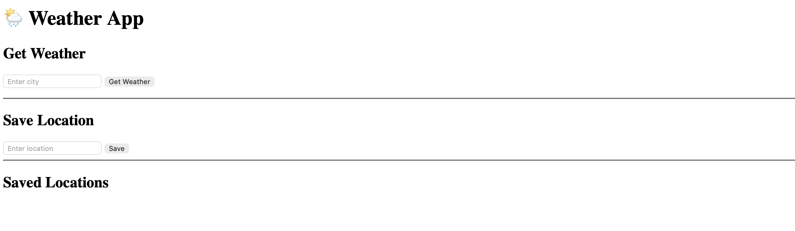
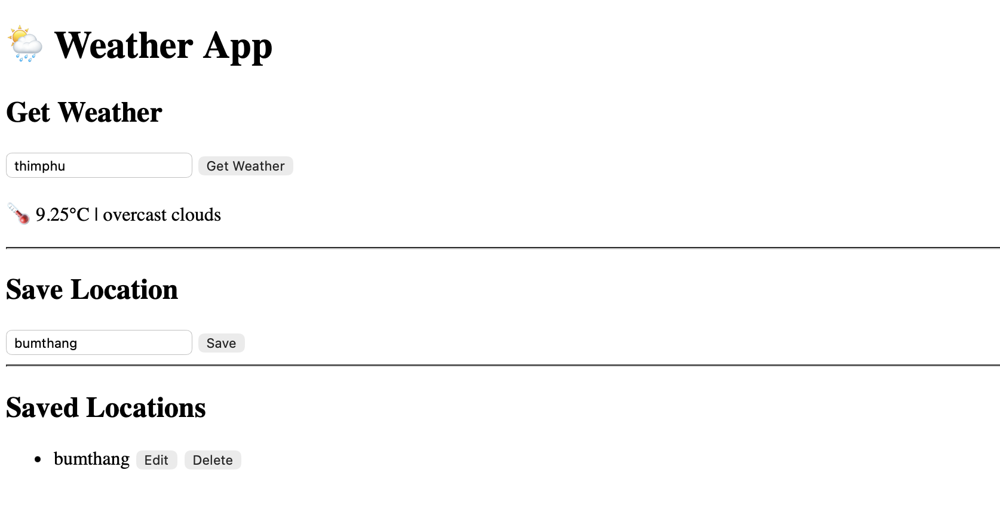

# 🌦️ Weather App

## 📌 Project Overview
The Weather App is a simple web application that allows users to:
- Fetch weather information using a city name
- Save locations for future use
- View, update, and delete saved locations

This project demonstrates CRUD operations (GET, POST, PUT, DELETE) and frontend interaction with APIs.

---

## ⚙️ Technology Stack

- **Framework:** Vanilla JavaScript
- **State Management:** DOM Manipulation
- **Styling:** Basic CSS
- **Form Handling:** HTML Forms
- **Data Fetching:** Fetch API

---

## 🚀 Setup Instructions

1. Navigate to project folder
```bash
cd weather-app
```

2. Open the application  
Open `index.html` in your browser

---

## 📁 Application Structure

```
weather-app/
│── index.html      # UI structure
│── script.js       # Logic and API handling
```

---

## 📄 Pages / Routes

- **index.html** → Main page that contains:
  - Weather input section
  - Save location section
  - Saved locations list

---

## 🧩 Component Organization

- UI is structured using HTML sections
- JavaScript functions act as components:
  - `getWeather()` → Handles weather fetching
  - `saveLocation()` → Handles saving locations
- Dynamic content is updated using DOM manipulation

---

## 🗂️ State Management

- State is managed using JavaScript variables
- Data is stored temporarily in memory
- UI updates dynamically using DOM methods

---

## 🔑 Key Components

### 1. Weather Input
- **Purpose:** Get weather data from user input  
- **Function:** Calls `getWeather()`  
- **Data:** City name  

---

### 2. Save Location
- **Purpose:** Store user-defined locations  
- **Function:** Calls `saveLocation()`  
- **Data:** Location name  

---

### 3. Location List
- **Purpose:** Display saved locations  
- **Function:** Dynamically updated list  
- **Data:** Array of saved locations  

---

## 🔐 Authentication Flow

No authentication is implemented in this project.

---

## 🔄 Features Implemented

- 🌍 Fetch weather using city name  
- 💾 Save locations  
- 📋 Display saved locations  
- ✏️ Update saved locations  
- ❌ Delete saved locations  

---

## 🧠 Implementation Details

- Used Vanilla JavaScript for simplicity
- Used Fetch API for HTTP requests
- Used DOM manipulation for UI updates
- Structured application for easy understanding

---

## 📷 Screenshots

```markdown


```

---

## 👤 Author

**Norzin Wangmo**

---

## 🔗 Repository Link

https://github.com/norzin-wangmo/02250359_Web101_Works.git